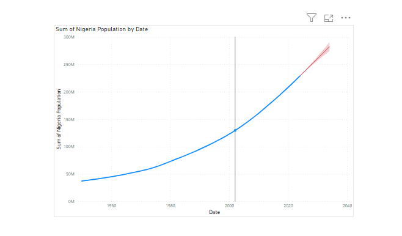

# DATA-FORECASTING AND WEBSCRAPPING USING-POWER-BI
DATA FORECASTING USING POWER BI

##INTRODUCTION
This is a personal project for webscrapping and data forecasting. The Data was downloaded directly from www.worldometer.com and linked to PowerBI for visualization and forcasting of population from 2024 to 2030. This method is used to show my ability in data analysis and how versatile power Bi can be.

____________________

_Disclaimer This data was used mainly for educational purpose. It does not represent any organisation, country or set of people.

_____________

PROBLEM STATEMENT
1. To forecast the population of Nigerians in the next six years.

_______________________________________

SKILLS USED/CONCEPTS 
- www.worldometer.com
- Power BI
- DAX
- Data Visualization
- Forecasting

____________

Outcomes  ---https://www.linkedin.com/posts/olusolafaustino5_hello-fam-i-want-to-share-direct-data-from-activity-7223080139474018304-yV3g?utm_source=share&utm_medium=member_desktop

_______________

_________________

